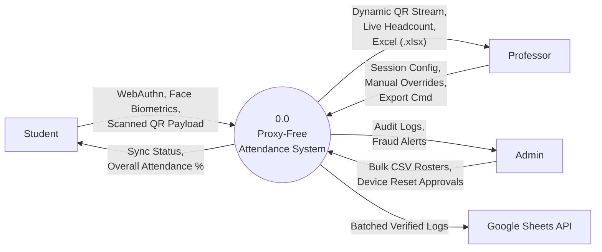
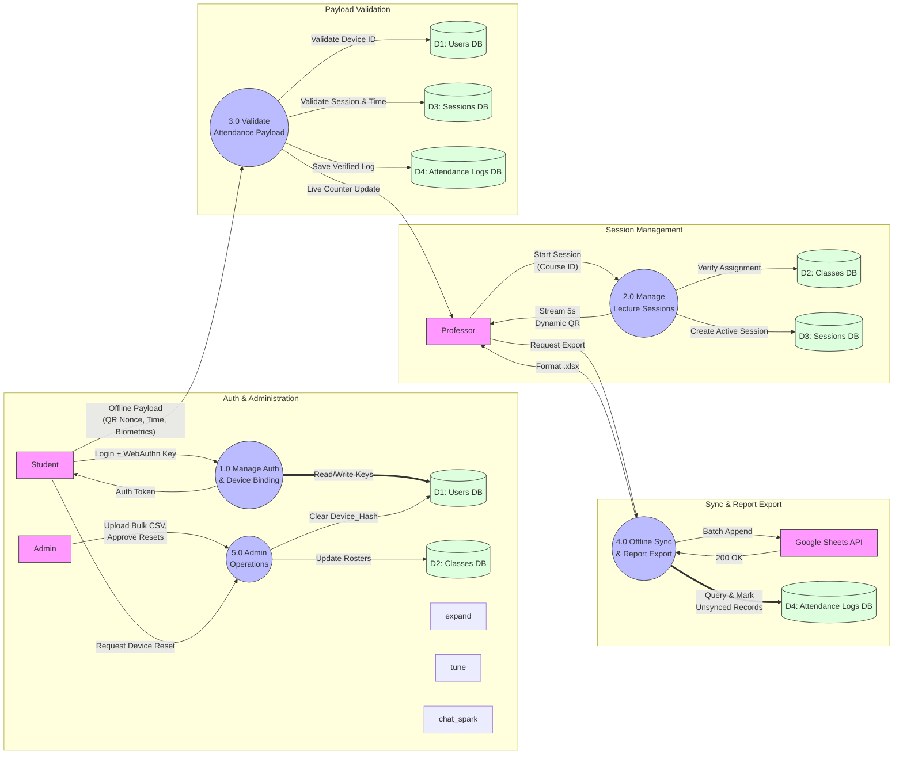

# Data Flow Diagrams (DFD)

_**Project**: Offline-First, Proxy-Free College Attendance System_

## 1. Level 0 DFD (Context Diagram)

**Purpose**: The Context Diagram provides a 10,000-foot view of the system. It shows the system as a single central process communicating with external entities (Student, Professor, Admin, and External APIs).

### Entities and Data Flows:

- **Student**: Submits login credentials, hardware tokens (`WebAuthn`), and scanned attendance payloads. Receives sync status and attendance analytics.

- **Professor**: Submits class session requests and manual overrides. Receives the real-time dynamic QR stream, live headcount, and exported `.xlsx` files.

- **Admin**: Submits bulk rosters and approves device resets. Receives system audit logs.

- **Google Sheets (External)**: Receives batched attendance rows.

### Level 0 Visual Map

## 2. Level 1 DFD (System Sub-Processes)

**Purpose**: The Level 1 DFD breaks down the central system into its primary sub-processes and introduces the Database Stores. This is what your professor will look at to understand how data moves internally.

### Database Stores (D1-D4):

- **D1 - Users DB**: Stores profiles, passwords, WebAuthn public keys, and 128D face vectors.

- **D2 - Classes DB**: Stores course mappings and Professor/Student enrollment mapping.

- **D3 - Sessions DB**: Stores active/past class sessions, start times, and course metadata.

- **D4 - Attendance Logs DB**: Stores the actual verified check-ins and the is_synced status.

### Main Processes (1.0 - 5.0):

1. **Manage Auth & Device Binding**: Handles WebAuthn 1:1 hardware locking and initial logins.

2. **Manage Lecture Sessions**: Validates Professor requests and generates the WebSocket dynamic QR token stream.

3. **Process & Validate Attendance (Core Engine)**: Validates the encrypted offline payloads, checks the timestamp/nonce, and enforces biometric matching.

4. **Data Sync & Export**: Background worker that generates Excel files and communicates with Google Sheets.

5. **Admin Operations**: Manages bulk uploads and device reset workflows.

### Level 1 Visual Map (Mermaid)

