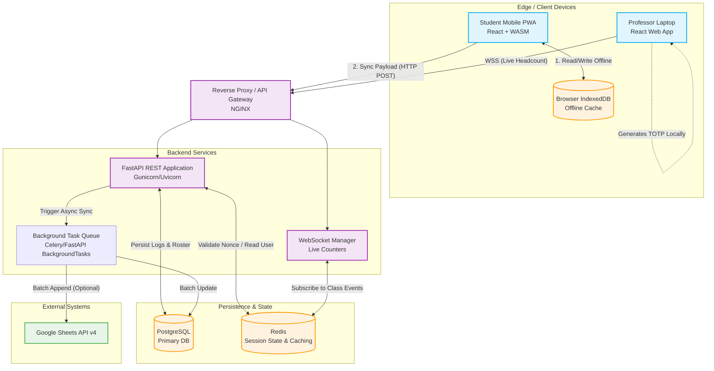

# High-Level Design (HLD) & System Architecture

_**Project**: Offline-First, Proxy-Free College Attendance System_

## 1. System Architecture Overview

The system follows a Client-Server architecture with an Offline-First Edge layer. It is designed to handle high-concurrency bursts (e.g., 240 students syncing data simultaneously at the end of a lecture) and total network partition (zero internet in classrooms).

The backend relies on asynchronous processing to decouple incoming student attendance scans from external rate-limited APIs (like Google Sheets).

## 2. High-Level Architecture Diagram

This diagram illustrates the physical and logical nodes of the system, showcasing the separation between the Client Tier, Application Tier, and Data Tier.

## 3. Core Component Breakdown

### 3.1. Edge Layer (Client Devices)

**Student PWA (React)**:

- Contains the Service Worker to cache static assets for offline cold-starts.

- Executes WebAssembly (`WASM`) for `MediaPipe/face-api.js` to perform 128D facial recognition locally without server compute.

- Uses WebAuthn API to sign payloads with the hardware Secure Enclave.

**Professor Dashboard (React)**:

- Runs the standalone `TOTP` (Time-Based One-Time Password) algorithm mathematically to generate dynamic QR codes every 5 seconds.

- Maintains a WebSocket connection (when online) to receive real-time headcount updates.

### 3.2. Load Balancer & API Gateway (NGINX)

- Handles TLS/SSL termination.

- Routes `/api/*` traffic to the FastAPI REST workers.

- Routes `/ws/*` traffic to the WebSocket manager.

- Acts as a rate-limiter to prevent DDoS attacks.

### 3.3. Application Layer (FastAPI)

- **REST API Controllers**: Written in Python using FastAPI. Handles JWT authentication, decrypts offline payloads, verifies WebAuthn signatures, and validates TOTP nonces.

- **WebSocket Manager**: Pushes event-driven updates (e.g., "Student X Marked Present") to the Professor's dashboard.

- **Background Tasks**: Handles heavy I/O operations (like generating .xlsx export files or pushing data to Google APIs) asynchronously so the main API thread is never blocked.

### 3.4. Data Storage Layer

- **PostgreSQL (Primary DB)**: Relational database ensuring ACID compliance. Stores Users , Courses , Device_Bindings , and Attendance_Logs .

**Redis (In-Memory Cache)**:

- Stores active session metadata (e.g., Class_ID: Session_Secret ) for rapid token validation.

- Used as a Pub/Sub message broker for WebSockets.

- Used for idempotent key caching (preventing double-processing if a student's phone submits the same offline log twice).

## 4. Key Architectural Decisions & Problem Solving

### 4.1. Solving the "Thundering Herd" Problem

**Problem**: A class of 240 students all regain Wi-Fi at the exact same moment (e.g., walking out of a dead-zone basement), causing a massive spike in `HTTP POST` requests.

**HLD Solution**:

- The API Gateway routes requests to FastAPI.

- FastAPI validates the payload and instantly drops it into an asynchronous queue (or writes quickly to Postgres) and returns 202 Accepted to the mobile app in under 50ms.

- The background worker processes the external Google Sheets API call later in batches of 100, preventing external API rate limits (HTTP 429).

### 4.2. Handling Idempotency (Duplicate Data Prevention)

**Problem**: Unstable networks cause mobile browsers to retry HTTP requests automatically. A student might accidentally submit the same attendance scan three times.

**HLD Solution**: Every payload generated by the PWA includes a UUID (Idempotency Key). The backend stores this key in Redis with a 24-hour TTL (Time to Live). If FastAPI sees the same UUID twice, it ignores the subsequent requests and returns 200 OK , ensuring the database only records one attendance entry per student per session.

### 4.3. Scaling Strategy

- **Stateless Compute**: The FastAPI servers are completely stateless. JWT tokens and WebAuthn signatures handle auth, meaning we can horizontally scale (add more FastAPI servers) effortlessly during peak exam or lecture hours.

- **Connection Pooling**: PgBouncer or SQLAlchemy connection pooling is utilized to prevent the FastAPI workers from exhausting the PostgreSQL connection limits during high-traffic syncs.
