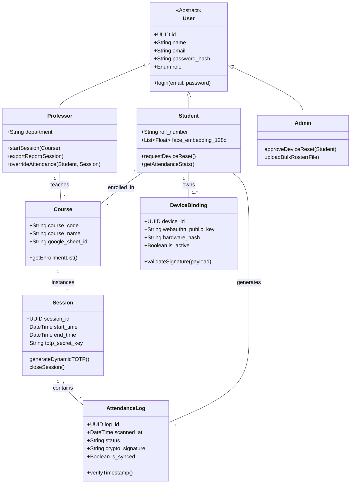
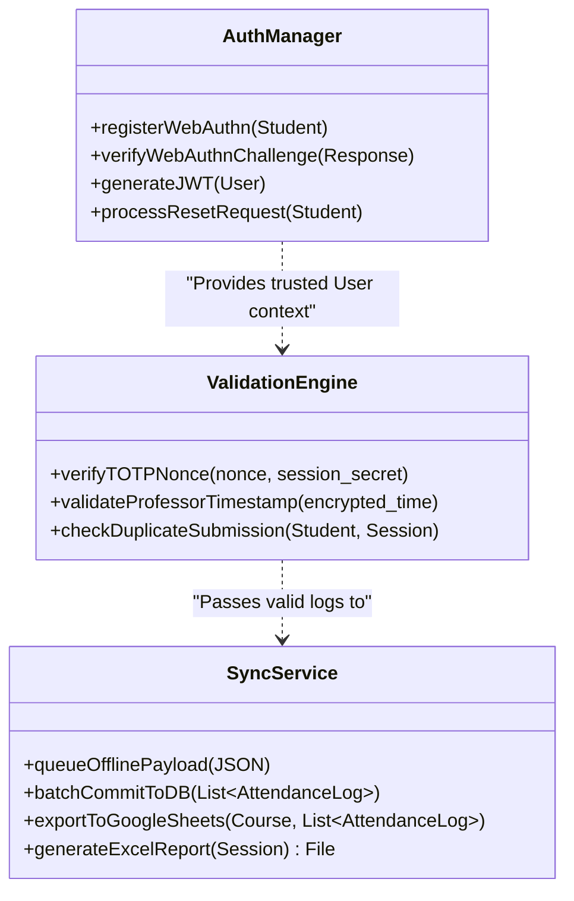
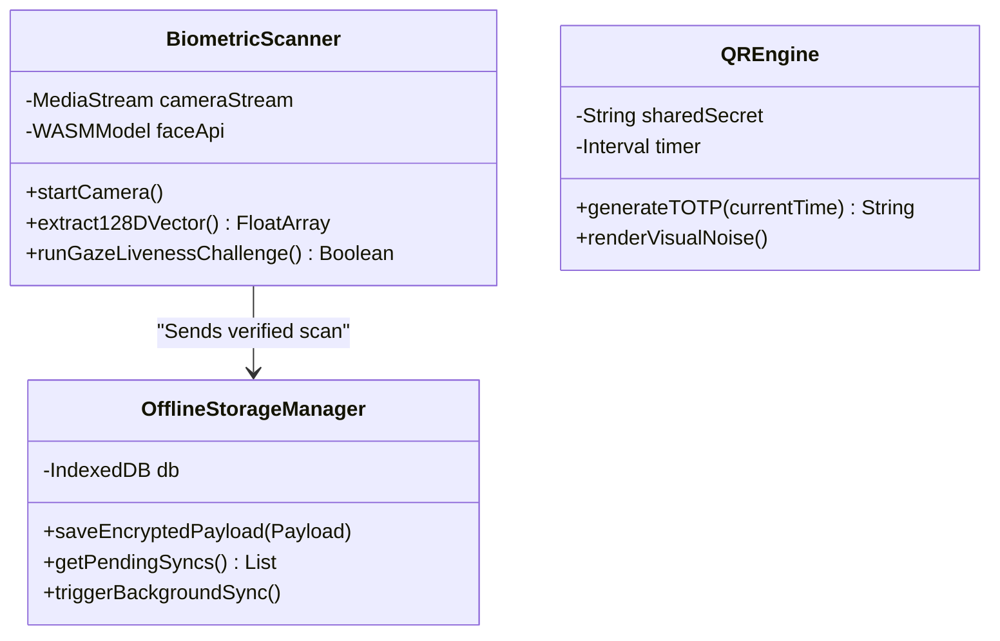

# Low-Level Design (LLD) & Class Diagrams

_**Project**: Offline-First, Proxy-Free College Attendance System_

This document outlines the Object-Oriented Low-Level Design (LLD) of the system. It defines the core domain models (entities), the backend service layer (FastAPI controllers), and the client-side managers (PWA/WASM).

## 1. Core Domain Models (Entity Layer)

This Class Diagram represents the database entities mapped via SQLAlchemy (Python ORM). It shows how Users, Courses, Sessions, and Attendance Logs relate to one another.

## UML Class Diagram (Mermaid)

## 2. Backend Service Layer (FastAPI Controllers)

These classes represent the business logic handlers in the FastAPI backend. They isolate the processing logic from the database models.

## 3. Client-Side (PWA) Managers

Since the system relies heavily on offline browser capabilities, the frontend (React/TypeScript) is modeled with specific manager classes to handle hardware APIs.

## 4. Design Patterns Utilized

- **Singleton Pattern**: Used for the DatabaseConnectionPool and OfflineStorageManager (IndexedDB) to ensure only one instance handles read/writes, preventing database locks or race conditions.

- **Strategy Pattern**: Used in the SyncService . The system can switch dynamically between professor's configuration. GoogleSheetsExportStrategy and ExcelDownloadStrategy depending on the

- **Factory Method**: Used to instantiate different types of User (Student, Professor, Admin) during the bulk CSV onboarding process, ensuring each role gets the correct default permissions.
